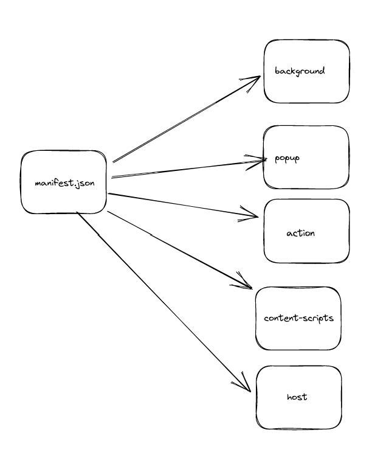
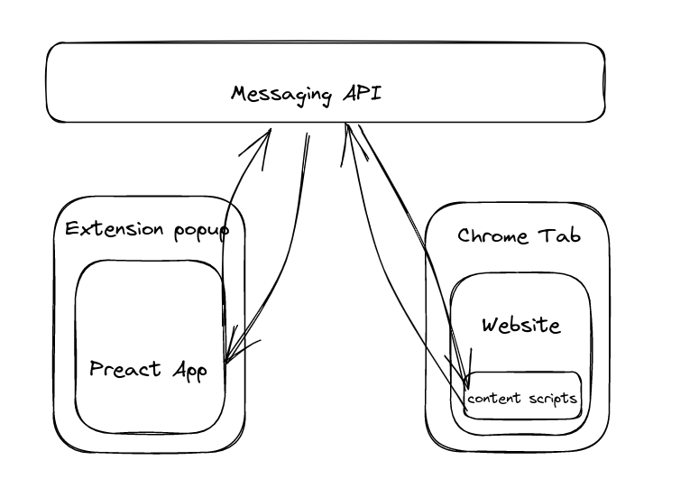

# SideNotes

SideNotes é uma extensão para o Google Chrome que auxilia na coleta, visualização e busca de trechos de texto pela internet.
Com SideNotes é possível selecionar uma pedaço de texto e adicioná-lo em sua biblioteca para revisitá-lo posteriormente.

## Como rodar a extensão locamente

Para rodar localmente é preciso carregar a extensão no Google Chrome, para isso:

0 - Faça o build da extensão com `npm run build-extension`

1 - Acesse a página de extensões digitando `chrome://extensions` em uma nova aba 

2 - Ative o "Modo do desenvolvedor " clicando no switch posicionado no canto superior direito

3 - Clique em "Carregar sem compactação"

4 - Navegue até a raiz do projeto e carregue a pasta `dist`
 

## To-do
- [x] Syncar o IndexedDB entre todas as abas => Adicionados em uma aba devem estar visível em todas

- [ ] Adicionar estilo ao trecho de texto selecionado (highligh)

- [ ] Exportar Notas em .md (cada nota um arquivou || um arquivo só para todas as todas)

- [x] Adicionar filtro por URL

## Visão Geral Sobre Como funciona

O principal arquivo que diz ao navegador que se trata de uma extensão é o `manifest.json`. É nele que declaramos os principais componentes de uma extensão.

Nessa extensão, temos:

- background: Localizado em `src/service-worker.ts` é o arquivo que gerencia a comunicação entre a extensão,sua aba host e o popup.

- popup: É a janela que aparece quando clica-se no ícone da extensão. É a view em Preact que consome do background.

- action: Define comportamento ao se clicar no ícone da extensão

- content-script: Localizado em `src/content-scripts` é o arquivo que tem acesso ao DOM do host e consegue se comunicar com o background via eventos

- host: A aba atual onde a extensão está sendo executada

A comunição entre os scripts de background e o content-scripts se dá a partir da API de eventos do navegador:

