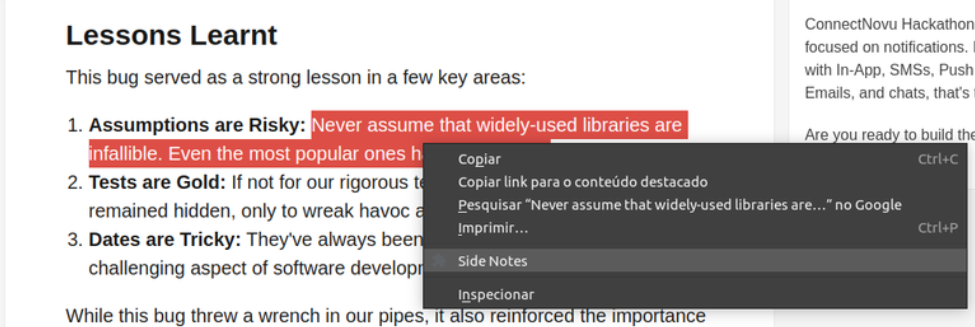
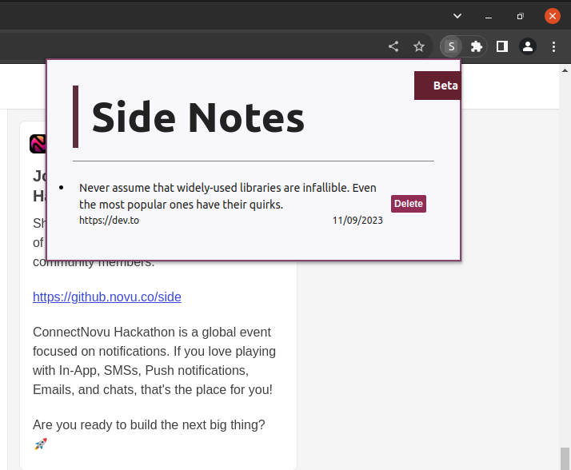
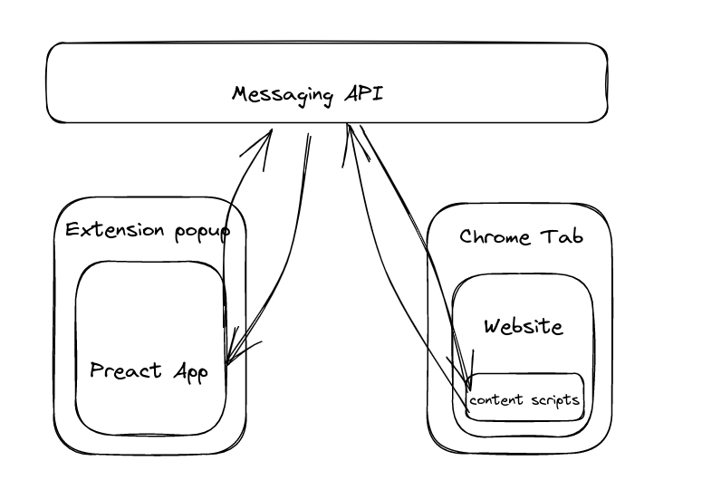

# SideNotes

SideNotes is a browser extension that helps you gather pieces of text information around the internet and saves them in the way of wasy visualization, just one click away.

## Running locally

To run the extension, it's needed to add the builded project within the Google Chrome.

0 - Build the project with `npm run build-extension`

1 - Open a new tab and o the extension page `chrome://extensions` 

2 - Activate the "Developer mode" by toggling the switch at the upper rigth corner

3 - Click on "Carregar sem compactação"

4 - Browse to the root of the project and select the `dist` folder

## An overview on how it works

#### In the user side, Sidenotes works like this:

1 - User selects a range of text and right click on it. The context menu will show up and the "Add to SideNotes" option will be available.

2 - The Note is added to the Local Storage's background and can be accesed clicking the SideNotes extension icon.

3 - The user might click on the note to be redirect to the original page

#### In the developer side:

As a browser extension, Sidenotes works mainly based on events provided by an messaging api that are used to comunicate with the integrated parts. The image below gives an overview of the comunication flow:

